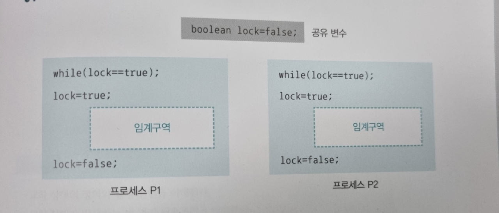
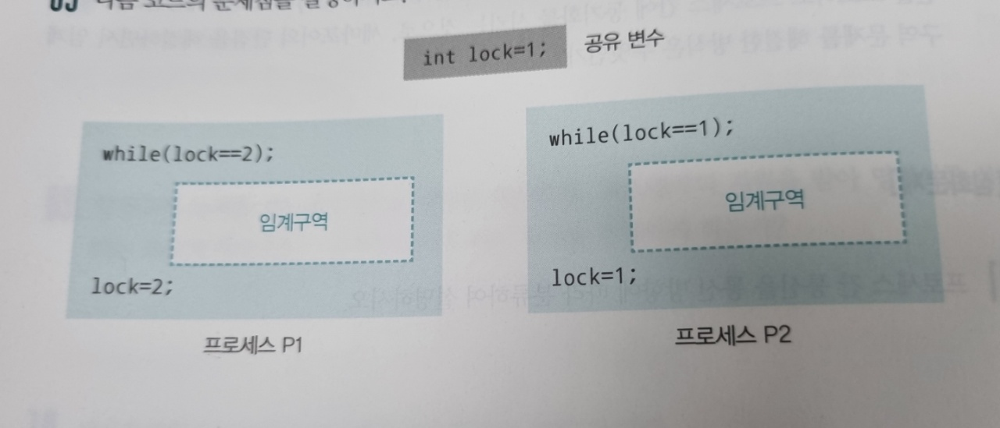

# 05 프로세스 동기화

*<쉽게 배우는 운영체제> pg 287~290*


## 연습문제

1. 프로세스 간 통신에서 데이터를 양방향으로 전송 가능하지만 동시 전송은 불가능하고 특정 시점에 한쪽 방향으로만 전송할 수 있는 통신 방식은 무엇인가?

```
반양방향 통신 ex) 무전기
```

2. 상태 변화를 살펴보기 위해 반복문을 무한 실행하며 기다리는 것을 무엇이라 하는가?

```
바쁜 대기
```

3. 프로세스 간 통신에서 대기가 없는 통신과 대기가 있는 통신의 예를 각각 제시하시오.

```
대기가 있는 통신(동기화 통신): 동기화를 지원 ex) 파이프, 소켓
대기가 없는 통신(비동기화 통신): 동기화를 지원하지 않음 ex) 전역 변수, 파일
```

4. 파이프를 이용하여 통신할 때 파이프를 2개 사용하는 이유는 무엇인가?

```
파이프는 단방향 통신을 지원하므로 양방향 통신을 하기 위해서 파이프를 2개 사용한다.
```

5. 공유 자원을 병행적으로 읽거나 쓰는 상황을 무엇이라 하는가?

```
경쟁 조건(race condition)
```

6. 공유 자원의 접근 순서에 따라 실행 결과가 달라지는 프로그램의 영역은 무엇인가?

```
임계 구역(critical section)
```

7. 임계구역 해결 조건 중 한 프로세스가 임계구역에 들어갔을 때 다른 프로세스는 임계구역에 들어갈 수 없는 조건을 무엇이라 하는가?

```
상호 배제(mutual exclusion)
```

8. 임계구역 해결 조건 중 한 프로세스가 다른 프로세스의 진행을 방해해서는 안 된다는 조건을 무엇이라 하는가?

```
진행의 융통성(progress flexibility)
```

9. 임계구역 문제를 하드웨어적으로 해결한 방식으로, 하드웨어의 지원을 받아 명령어를 실행하는 도중에 타임아웃이 걸리지 않도록 하는 방식을 무엇이라 하는가?

```
검사와 지정(test-and-set)
```

10. 세마포어의 Sempaphore(n)에서 n은 무엇을 가리키는가?

```
현재 사용 가능한 자원의 수
```

11. 세마포어에서 내부 변수를 RS라고 할 때 세마포어 P()의 내부 코드를 쓰시오.

```c
if RS>0 then RS=RS-1;
else block();
```

12. 세마포어에서 내부 변수를 RS라고 할 때 세마포어 V()의 내부 코드를 쓰시오.

```c
RS=RS+1;
wake_up();
```

13. 세마포어가 제대로 작동하지 않는 경우를 설명하시오.

```
1. 세마포어를 사용하지 않고 바로 임계구역에 진입하는 경우
2. P()를 두 번 사용하여 wake_up() 신호가 발생하지 않는 경우
3. P()와 V()를 반대로 사용하여 상호 배제가 보장되지 않는 경우
```

14. 세마포어의 내부 코드도 타임아웃이 걸리면 문제가 발생할 수도 있다. 그래서 내부 코드는 무엇으로 보호받는가?

```
검사와 지정(test-and-set)
```

15. 공유 자원을 내부적으로 숨기고 공유 자원에 접근하기 위한 인터페이스만 제공함으로써 자원을 보호하고 프로세스 간에 동기화를 시키는 것으로, 세마포어의 단점을 해결하면서 임계구역 문제를 해결한 방식은 무엇인가?

```
모니터
```


## 심화문제

1. 프로세스 간 통신을 통신 방향에 따라 분류하여 설명하시오.

```
1. 양방향 통신 : 동시에 양쪽 방향으로 전송 가능
ex) 소켓, 일반 통신
2. 반양방향 통신 : 양쪽 방향으로 전송 가능, 동시 전송 불가능
ex) 무전기
3. 단방향 통신 : 한쪽 방향으로만 전송 가능
ex) 전역 변수, 파이프, 파일

[추가 설명]
1. 양방향 통신 : 데이터를 동시에 양쪽 방향으로 전송할 수 있는 구조로, 일반적인 통신은 모두 양방향 통신이다. 프로세스 간 통신에서는 소켓 통신이 양방향 통신에 해당한다.
2. 반양방향 통신 : 데이터를 양쪽 방향으로 전송할 수 있지만 동시 전송은 불가능하고 특정 시점에 한쪽 방향으로만 전송할 수 있는 구조이다. 반양방향 통신의 대표적인 예는 무전기이다.
3. 단방향 통신 : 모스 신호처럼 한쪽 방향으로만 데이터를 전송할 수 있는 구조이다. 프로세스간 통신에서는 전역 변수와 파이프가 단방향 통신에 해당한다.
```

2. 대기가 있는 통신과 대기가 없는 통신의 의미를 설명하고 적절한 예를 제시하시오.

```
대기가 있는 통신(동기화 통신): 동기화를 지원 ex) 파이프, 소켓
대기가 없는 통신(비동기화 통신): 동기화를 지원하지 않음 ex) 전역 변수, 파일

[추가 설명]
1. 대기가 있는 통신 : 동기화를 지원하는 통신 방식이다. 데이터를 받는 쪽은 데이터가 도착할 때까지 자동으로 대기 상태에 머물러 있다.
2. 대기가 없는 통신 : 동기화를 지원하지 않는 통신 방식이다. 데이터를 받는 쪽은 바쁜 대기를 사용하여 데이터가 도착했는지 여부를 직접 확인한다.
```

3. 실생활의 예를 들어 임계구역 문제를 설명하시오.

```
- 주방의 믹서기를 사용할 때는 순서를 지켜 작업해야 함, 이미 믹서기를 사용중인 프로세스가 있을 때는 해당 프로세스가 끝날 때까지 기다려야 함

- 하나의 통장을 공유하는 A, B가 있다고 가정하였을 때, 예금확인 및 입금이 동시에 이뤄지는 경우가 있다. A가 예금확인을 한 후, B가 입금을 하면 예금의 금액이 달라지는데 A는 이전 예금을 확인한 상태이기 때문에 입금 후 최종 예금에 저장되는 금액이 달라지는 문제가 생길 수 있다.
```

4. 다음 코드의 문제점을 설명하시오.

   

```
타임아웃으로 인해 한 줄씩 코드가 실행될 경우, while(lock==true)문을 둘 다 빠져나와 임계구역에 2개의 프로세스가 진입하게 됨. 따라서 상호 배제 문제를 발생시킴.
상호 배제 문제 : 한 프로세스가 임계구역에 들어가면 다른 프로세스는 임계구역에 들어갈 수 없다.
+시스템 자원 낭비 문제 : 잠금이 풀리기를 기다리는 동안 바쁜 대기가 일어나 시스템 자원 낭비 (while문)
```

5. 다음 코드의 문제점을 설명하시오.

   

```
서로 번갈아가면서 실행되어 한 프로세스가 두 번 연속으로 임계구역에 진입하고 싶어도 불가능함에 따라 진행의 융통성 문제 발생시킴.
진행의 융통성 문제(경직된 동기화) : 한 프로세스의 진행이 다른 프로세스로 인해 방해받는 현상
```

6. 파일을 이용하여 Test라는 문자를 주고받는 코드를 작성하시오.

   ```java
   # include <studio.h>
   # include <unistd.h>
   # include <fcntl.h>
   
   void main()
   {	int pid, fd;
    	char buf[5];
    
    	fd=open("com.txt", 0_RDWR); // init
    	pid=fork();
    
    	if(pid<0 || fd<0) exit(-1);
    
    	else if(pid==0) { // child
           write(fd, "Test", 5);
           close(fd);
           exit(0);	}
    
    	else {	wait(0); // parent
             lseek(fd, 0, SEEK_SET);
             read(fd, buf, 5);
             printf("%s", buf);
             close(fd);
             exit(0);	}
   }
   ```
