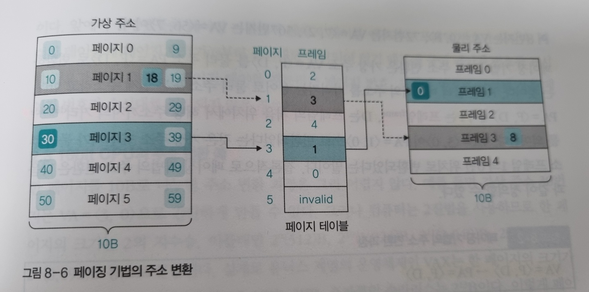

**<연습문제>**

1. 물리 메모리 + 스왑 영역

2. 해당 컴퓨터 시스템이 가진 물리 메모리의 최대 크기(CPU의 비트)

3. 페이지 테이블

4. VA=<P, D> -> PA=<F, D>

5. 페이지 테이블 엔트리(PTE)

6. P(Page)=(가상 주소/한 페이지의 크기)의 몫, D(Distance)=(가상 주소/한 페이지의 크기)의 나머지

7. 페이지 테이블 기준 레지스터(PTBR)

8. 연관 매핑

9. 직접 매핑

10. 집합-연관 매핑

11. 역매핑

12. 변환 색인 버퍼(TLB) or 연관 레지스터

13. TLB 미스

14. 스왑 영역

15. 동적 주소 변환(DAT)

16. 트랩

17. 매핑 테이블

    

**<심화 문제>**

1. 가상 메모리의 크기

   - 이론적 크기 : 무한대
     - 가상 메모리 시스템에서는 물리 메모리의 내용 중 일부를 하드디스크의 일부 공간인 스왑 영역으로 옮길 수 있기 때문
   - 실제 크기 : 컴퓨터 시스템이 가진 물리 메모리의 최대 크기 (CPU 비트)

2. 페이징 기법의 주소 변환 과정

   

   - 가상 주소의 30번지가 어느 페이지에 있는지 찾음. 30번지는 페이지 3의 0번째 위치에 있음
   - 페이지 테이블의 페이지3으로 가서 해당 페이지가 프레임1 에 있다는 것을 확인
   - 최종적으로 물리 메모리 해당 프레임1의 0번째 위치에 접근

3. 연관 매핑의 동작

   - 메모리에 접근하기 위해 변환 색인 버퍼를 찾아본다.
   - 원하는 페이지 번호가 있는 경우 : TLB 히트로, 곧바로 물리주소로 변환
   - 원하는 페이지 번호가 없는 경우 : TLB 미스로, 스왑 영역에 저장된 직접 매핑 테이블을 사용하여 프레임 번호로 변환

4. 집합-연관 매핑의 동작

   - VA=<P1, P2, D>
   - P1을 이용하여 디렉터리 테이블에서 주소를 찾음
   - I라고 표시되어 있지 않은 경우 : TLB히트로, 묶음 테이블의 시작 주소에 시작 주소가 명시되어 있음.
   - I라고 표시되어 있는 경우 : TLB미스가 발생한 것
   - P2를 이용하여 묶음 테이블에서 원하는 프레임 번호를 얻음

5. 역매핑의 동작

   - 프로세스 아이디와 페이지 번호가 물리 메모리에 있는지 역매핑 테이블에서 검색
   - 없으면 스왑 영역에서 가져옴

6. 세그먼테이션-페이징 혼용 기법을 사용하는 이유

   - 페이징 기법에서 권한비트를 추가하면 메모리 접근 권한이 거의 같은데도 불구하고 행마다 페이지 테이블에 생겨 낭비가 발생한다.
   - 이를 세그먼테이션 테이블을 이용하여 서로 관련 있는 영역을 하나의 세그먼트로 묶어 세그먼테이션 테이블로 관리하는 방식으로 해결할 수 있다.
   - 이에 따라 테이블 크기를 줄일 수 있다.

