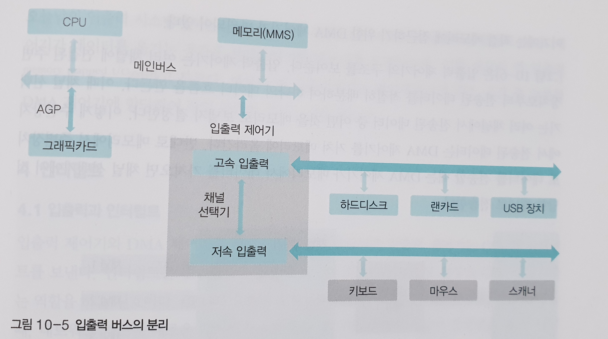

# 00 제목

*<쉽게 배우는 운영체제> pg 000~000*


## 연습문제

1. 

   ```
   외부 인터럽트
   ```

2. 

   ```
   내부 인터럽트
   ```

3. 

   ```
   시그널
   ```

4. 

   ```
   인터럽트 핸들러
   ```

5. 

   ```
   각속도 일정방식
   ```

6. 

   ```
   선속도 일정방식
   ```

7. 

   ```
   탐색시간
   ```

8. 

   ```
   회전 지연 시간
   ```

9. 

   ```
   NAS
   ```

10. 

    ```
    SSTF
    ```

11. 

    ```
    블록 SSTF 디스크 스케쥴링
    ```

12. 

    ```
    SCAN
    ```

13. 

    ```
    LOOK
    ```

14. 

    ```
    RAID 0
    ```

15. 

    ```
    짝수배
    ```

16. 

    ```
    RAID 10
    ```

    


## 심화문제

1. 

   

   ```
   CPU, 메모리는 메인버스와 연결, 주변 장치는 속도에 따라서 고속 입출력 버스, 저속 입출력 버스로 구별한다. 고속 입출력 버스에만 사용하는 그래픽 카드가 있다.
   ```

2. 

   ```
   외부 인터럽트 : 입출력 및 하드웨어 관련 인터럽트(주변장치 변화, 하드웨어 이상)
   내부 인터럽트 : 프로세스의 오류로 발생하는 인터럽트(예외 상황 인터럽트)
   시그널 : 사용자의 요청으로 발생하는 인터럽트(자발적 인터럽트)
   ```

3. 

   ```
   각속도 일정 방식 : 일정한 시간 동안 이동한 각도가 같다는 의미, ex) 하드디스크의 플래터(항상 일정한 속도로 회정하여 바깥쪽 트랙의 속도가 안쪽 트랙의 속도보다 훨씬 빠름)
   선속도 일정 방식 : 어느 트랙에서나 단위 시간당 디스크의 이동 거리가 같음 ex) cd(헤드가 안쪽 트랙에 있을 떄는 디스크의 회전 속도를 빠르게 하고, 헤드가 빠깥쪽 트랙으로 이동했을 때는 디스크의 회전 속도를 느리게 해야 함)
   ```

4. 

   ```
   장점 : 현재 헤드가 있는 위치에서 가장 가까운 트랙부터 서비스하기 떄문에 효율성이 좋음
   단점 : 아사 현상을 일으킬 수 있다(가장 안쪽 혹은 바깥쪽에 있는 트랙은 서비스 받을 확률이 낮기 때문)
   ```

5. 

   ```
   SCAN 디스크 스케줄링의 불필요한 부분을 제거하여 효율을 높인 기법이다.
   SCAN 디스크 스케줄링에서는 트랙 요청이 없어도 헤드가 맨 마지막 트랙에 도착한 후에야 방향을 바꾸지만 LOOK 디스크 스케줄링에서는 더이상 서비스할 트랙이 없으면 헤드가 끝까지 가지 않고 중간에서 방향을 바꾼다.
   ```

6. 

   ```
   SCAN 디스크 스케줄링을 변형한 것으로 헤드가 한쪽 방향으로 움직일 때는 요청받은 트랙을 서비스하고 반대 방향으로 돌아올 때는 서비스하지 않고 이동만 한다.
   ```

7. 

   ```
   공통점 : RAID 10과 RAID 0+1은 둘 다 병렬로 데이터를 처리하여 입출력 속도를 높일 수 있으며 , 장애 발생 시 미러링된 디스크로 복구가 가능하다.
   RAID 10 : 일부 디스크만 중단하여 복구할 수 있다.
   RAID 0+1 : 장애가 발생했을 때 복구하기 위해 모든 디스크를 중단해야 함

