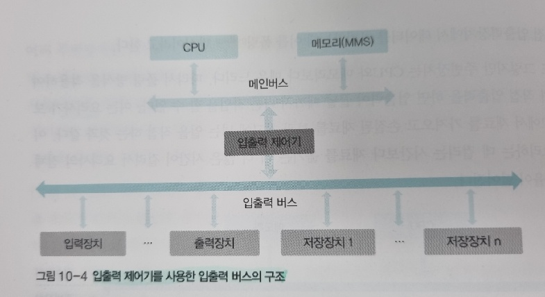
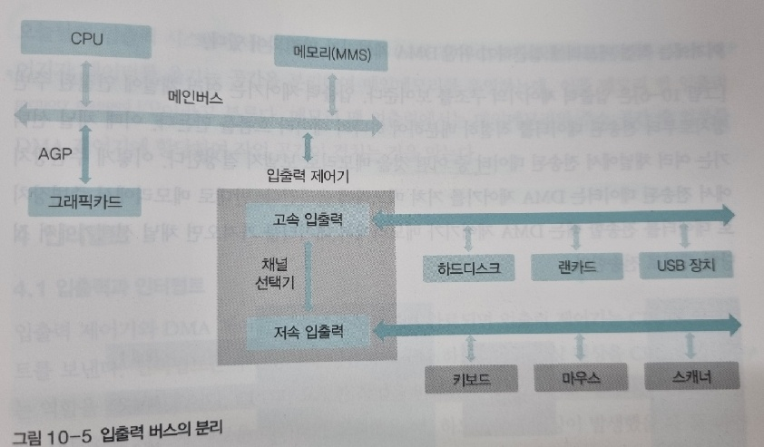

**<연습문제>**

1. 외부 인터럽트 or 하드웨어 인터럽트

2. 내부 인터럽트

3. 시그널

4. 인터럽트 핸들러

5. 각속도 일정 방식

6. 선속도 일정 방식

7. 탐색 시간

8. 회전 지연 시간

9. NAS(Network Attached Storage)

10. FCFS

11. 블록 SSTF

12. SCAN

13. LOOK

14. 0

15. 2배

16. 10

    

**<심화 문제>**

1. 입출력 버스의 구조

   

   

2. 인터럽트의 종류

   - 외부 인터럽트
     - 입출력 및 하드웨어 관련
     - 주변장치 변화, 하드웨어 이상
   - 내부 인터럽트
     - 프로세스 오류로 발생
     - 예외 상황 인터럽트
   - 시그널
     - 사용자 요청으로 발생
     - 자발적 인터럽트

3. 각속도 일정 방식과 선속도 일정 방식

   - 각속도 일정 방식(하드디스크)
     - 회전 : 항상 일정한 속도로 회전하여 바깥쪽 트랙의 속도가 안쪽 트랙의 속도보다 훨씬 빠름
     - 섹터 : 모든 트랙의 섹터 수가 같아, 바깥쪽 섹터 크기가 안쪽 섹터 크기보다 큼
   - 선속도 일정 방식(CD)
     - 회전 : 어느 트랙에서나 단위 시간당 디스크의 이동 거리가 같아, 헤드가 안쪽 트랙에 있을 때는 빠르게, 바깥쪽 트랙에 있을때는 느리게 작동
     - 섹터 : 모든 트랙의 움직이는 속도가 같아 섹터의 크기도 같음 

4. SSTF 장단점

   - 장점
     - 효율성 좋음
   - 단점
     - 아사 현상 발생 가능
       - 헤드가 중간에 위치하면 가장 안쪽이나 가장 바깥쪽에 있는 트랙은 서비스 받을 확률이 낮아지기 때문
     - 공평성 위배

5. LOOK 디스크 스케줄링이 만들어진 이유

   - SCAN 디스크 스케줄링의 불필요한 부분을 제거하여 효율을 높이기 위해 만들어짐
   - 헤드가 끝까지 가지 않고 더 이상 서비스할 트랙이 없으면 중간에서 방향을 바꿈

6. C-SCAN 디스크 스케줄링

   - SCAN 디스크 스케줄링의 공평성 위배 문제를 해결
   - SCAN 디스크 스케줄링을 변형한 것으로, 헤드가 한쪽 방향으로 움직일 때는 요청받은 트랙을 서비스하고 반대 방향으로 돌아올 때는 서비스하지 않는 스케줄링 방식

7. RAID 10과 RAID 0+1

   - RAID 10
     - RAID 1로 먼저 묶고, RAID 0으로 묶음
     - 일부 디스크만 중단하여 복구 가능
   - RAID 0+1
     - RAID 0로 먼저 묶고, RAID 1으로 묶음
     - 장애 발생시 복구를위해 모든 디스크를 중단

