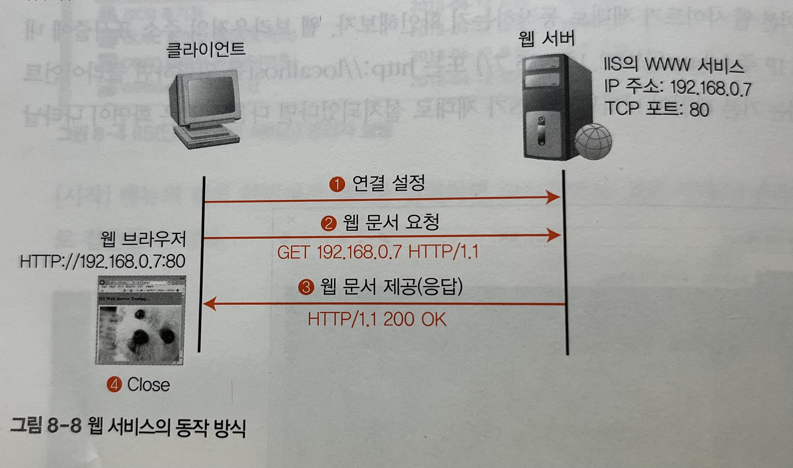

# 08 네트워크 서비스

*<네트워크 개론> pg 400~401*


## 연습문제

1. 

   
   
2. 

   ```
   80 (WWW-HTTP)
   ```

3. 

   ```
   IIS(인터넷 정보 서비스) 관리자 화면에서 확인
   ```

4. 

   ```
   1. 클라이언트는 원하는 정보가 있는 FTP 사이트에 접속하여 해당 공유 파일을 내 컴퓨터에 다운로드하거나 업로드하기 위해 웹 브라우저 또는 FTP 프로그램ㅁ을 사용
   2. 공유 파일이 있는 FTP 사이트의 IP 주소와 포트 번호 21로 요청
   3. 로그온 창에 사용자 이름과 암호 입력해 접속
   4. 클라이언트의 요청을 받은 FTP 서버는 자신의 홈 디렉터리 내용을 클라이언트에 전송
   5. 파일을 선택하면 다운로드 가능
   ```

5. 

   ```
   SMTP
   ```


## 기출문제

1. 

   ```
   1
   ```

2. 

   ```
   4: 80
   ```

3. 

   ```
   4
   ```

4. 

   ```
   2
   ```

5. 

   ```
   3
   ```
